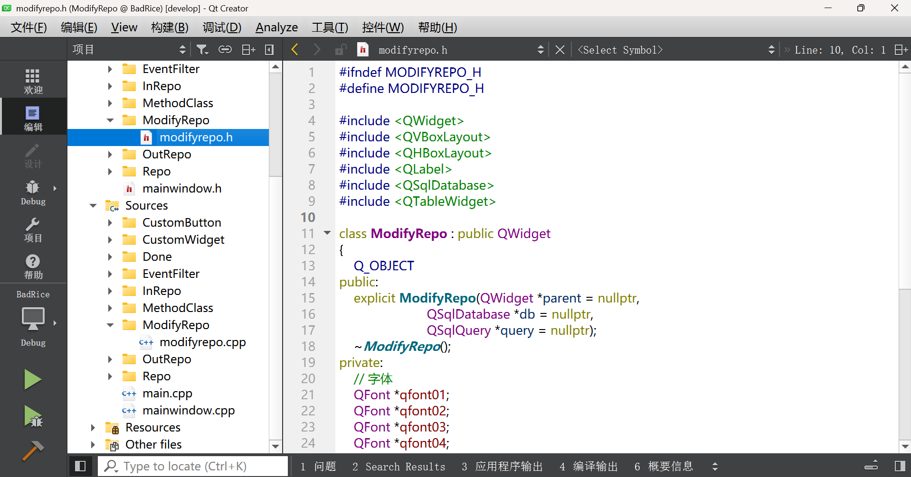
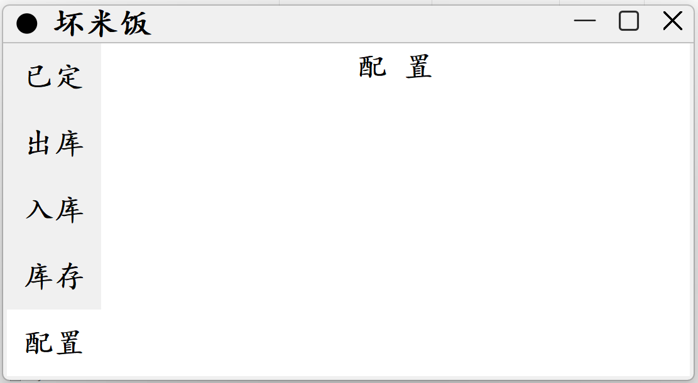

# “坏米饭”开发日记一

​	今天是2024年9月6号，下午16点08分，西安，初秋，即使室外35度，室内的温度也刚好。“已定”、“出库”、“入库”、“库存”这四个模块，各自的独立逻辑已经编写完成，但还差各自的独立测试。此外，四个模块之间的协同，以及对于协同的测试，也在等待完成。在这个短暂的空档期，我开始有机会，编写“配置”模块。

​	当然，配置模块完成后，需要对配置模块进行独立测试，此外，五个模块之间的协同、五个模块之间协同的测试，以及最终的大测试，都是需要的。为什么要进行测试呢？因为要找问题并改正。这跟大学不同。

​	除了测试之外，也还需要，不停修改各个模块的代码。此外，如果可能的话，修改Framless文件夹中的代码，让Framless框架，不光能适用于Qt5.12.10，而且能适用于Qt6.7。人们常说，“人和代码，有一个能跑，就行了”，我不喜欢它。我猜，代码只有不断修改，才能保持活力。这不同于功能的新增，不同于广告的植入，不同于盈利模式的创新。而是减法，和偶尔的加法。为什么？我不希望看到，坏米饭，步微软和华为的后尘。

​	人们说，你故事讲这么好，那写代码呢？你的代码写得好么？我不是一个擅长写代码的人，想象力与创造力，无法帮助我在二进制世界里，做得很好。那需要感知力与逻辑分析力。很久以前的理综，我只有233分，足以证明。可能我擅长的，恩，可能被叫作擅长吧，数学145分，或许在别的什么地方，支撑我。

​	用汉字写日记，直觉上比写代码，更容易让人接受。也有逃避写代码的倾向。我一直努力在规避这一点。高谈阔论，畅谈“配置”里该有什么，落到实处，可能截然不同。靠充分了解Qt和C++也无法规避这一点，我猜，这是物理定理吧。毕竟，坏米饭，是一个优雅机灵的小孩儿，不是Ross这个书呆子。

