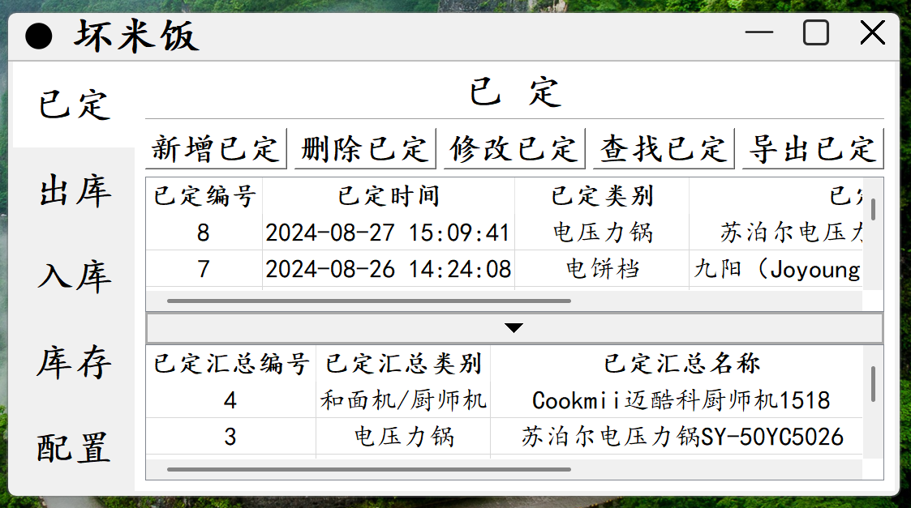
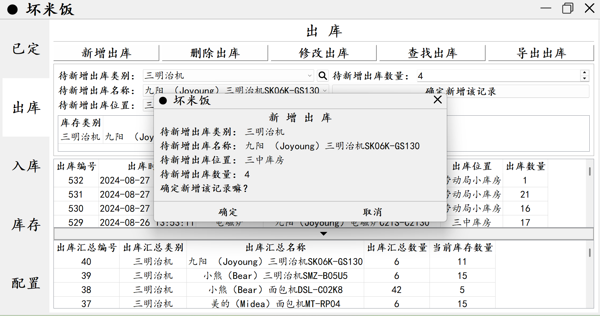
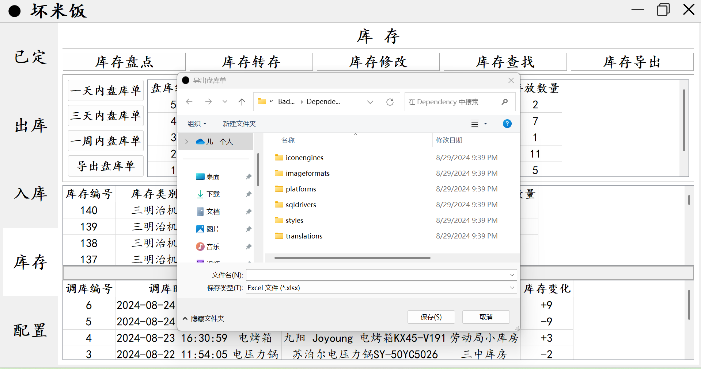

# QtForWindows-xiaoxingjiadiankucunguanlimokuai

​	这个项目的名字叫作，QtForWindows-小型家电库存管理模块。我怎么开发的呢？我购买了“逆枫”的Qt无边框程序框架，使用Qt Creator5.12.10这个IDE，基于SQLite数据库和QWidget等组件，开发了这款简单有效的Windows桌面程序。

​	问题来了，为什么我要自定义边框，而不是使用Windows布局管理器默认的桌面程序框架呢？问得好，如果你尝试去调整桌面程序框架的标题的字体，你就会发现，没有办法调整，只能使用默认的微软雅黑。诚然，默认的微软雅黑是一款很棒的字体，但是标题框过小，而且没有办法调整，这对于我妈妈而言，看上去真得非常累。

​	楷书是一个非常棒的字体，我姥爷很喜欢楷书。西安早市上的菜摊里，商贩们拿着保温板，在上面用正楷写着“小白菜 4.5元一斤”，在招聘会上，也用正楷写着“招聘Qt C++开发，招聘Python开发”。所以我想，把程序的字体设置为楷书，这将会是一个很酷的事情。另外，把标题框设置成大大的样子，我妈妈将会很开心。因此，我设置了这样子的自定义边框。

​	为什么没有将仓库公开，将代码开源呢？虽然将代码开源是一个好习惯，但是这个项目倾注了我很多的心血，进行了大量的优化与重构。最重要的是，听我妈妈的话，做了大量的改动，所以我并不想将代码开源。