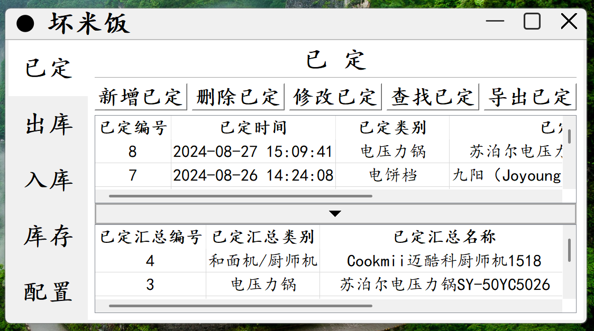
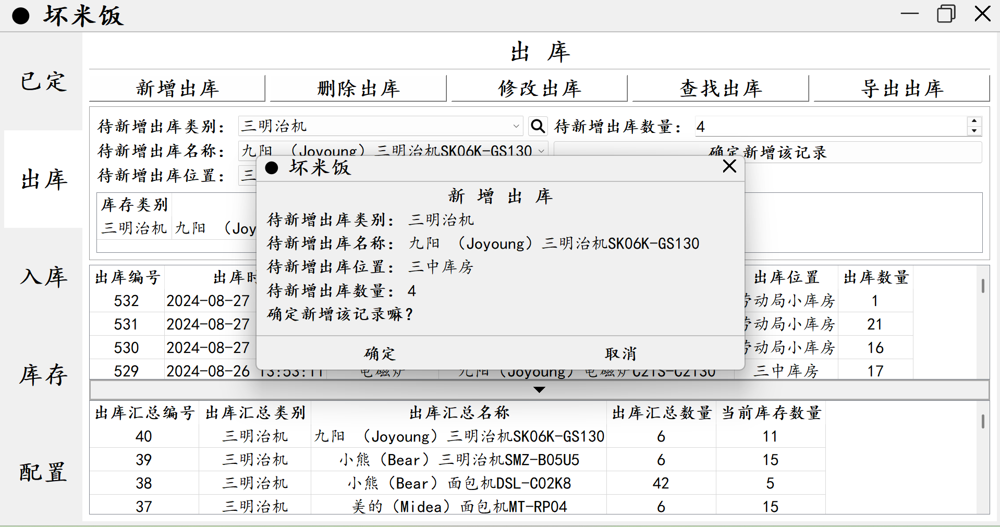
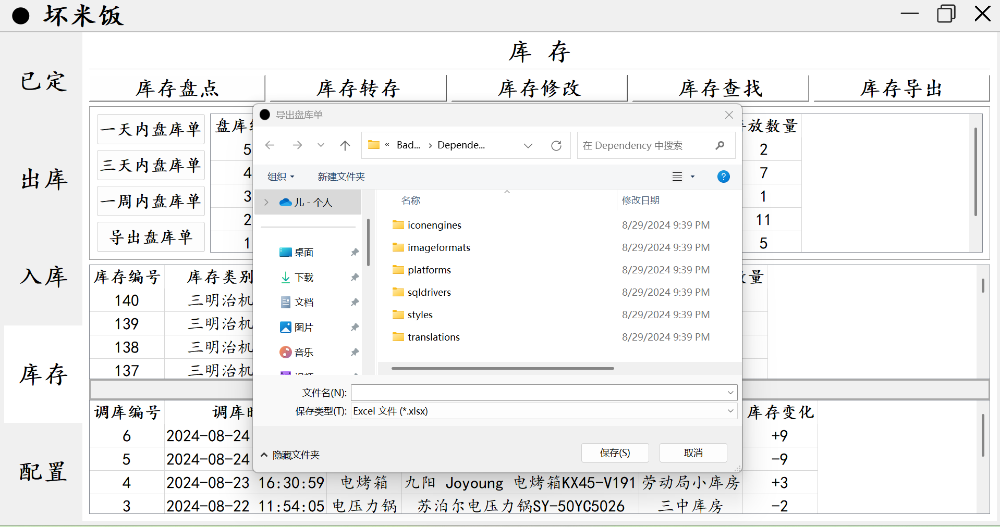
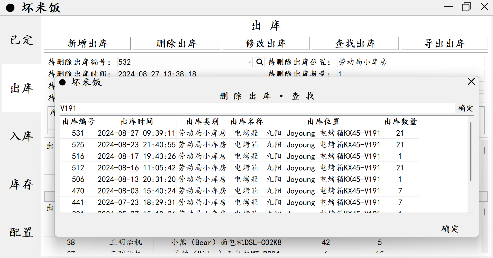

# QtForWindows-小型家电库存管理模块

​	这个项目的名字叫作，QtForWindows-小型家电库存管理模块。我怎么开发的呢？我购买了“逆枫”的Qt无边框程序框架，使用Qt Creator5.12.10这个IDE，基于SQLite数据库和QWidgets的组件，在文心一言、通义千问、豆包，以及偶尔使用的ChatGPT的帮助下，开发了这款简单有效的Windows桌面程序。

​	问题来了，为什么我要自定义边框，而不是使用Windows布局管理器默认的桌面程序框架呢？问得好，如果你尝试去调整桌面程序框架的标题的字体，你就会发现，没有办法调整，只能使用默认的微软雅黑。诚然，默认的微软雅黑是一款很棒的字体，但是标题框过小，而且没有办法调整，这对于我妈妈而言，看上去真得非常累。

​	楷书是一个非常棒的字体，我姥爷很喜欢楷书。西安早市上的菜摊里，商贩们拿着保温板，在上面用正楷写着“小白菜 4.5元一斤”，在招聘会上，也用正楷写着“招聘Qt C++开发，招聘Python开发”。所以我想，把程序的字体设置为楷书，这将会是一个很酷的事情。另外，把标题框设置成大大的样子，我妈妈将会很开心。因此，我设置了这样子的自定义边框。

​	有一说一，8月20号回西安的前一天，当我把Demo拿给妈妈看的时候，她说，“太简单了吧”，还说，“我不希望你把时间浪费在这个上面，你得把心思都放在学习上”。那时还大一的董静轩说，“适合给我家搞一个”。诚然，这个系统的确很简单。但是，我只是一个普通人，大型的ERP软件，（我猜可以把它归类为大事），我不想去做，而且，我也做不了。南开的艾跃进叔叔说，大事，肉食者谋之，轮不到你。最重要的一点，我妈妈是库管，能用我自己的所学，让我妈妈的工作更轻松一点，我想，就足够了。